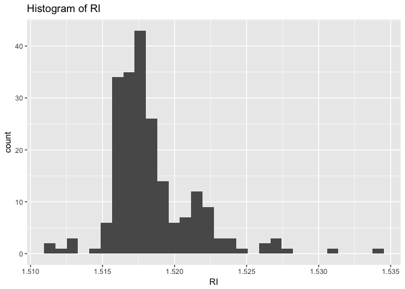
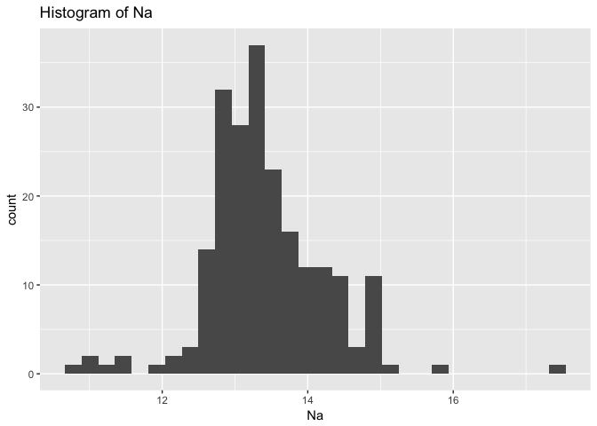
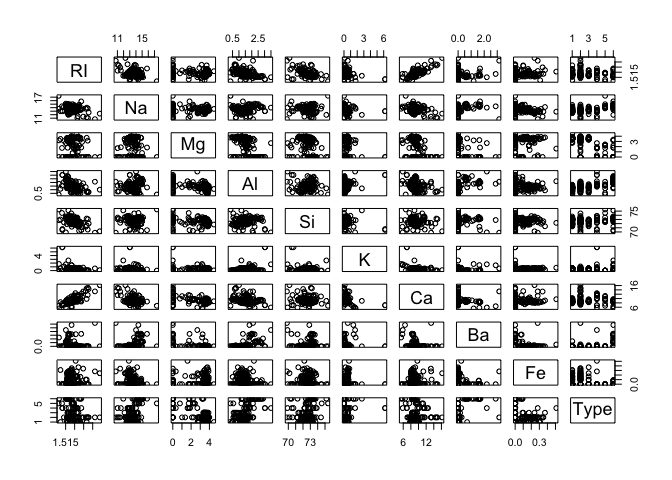
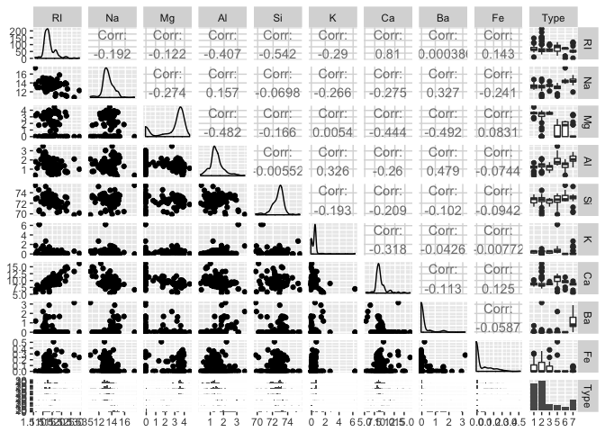

Chapter 3
================
Lawrence Wu
November 14, 2016

3.1
---

``` r
library(mlbench)
data(Glass)
glimpse(Glass)
```

    ## Observations: 214
    ## Variables: 10
    ## $ RI   <dbl> 1.52101, 1.51761, 1.51618, 1.51766, 1.51742, 1.51596, 1.5...
    ## $ Na   <dbl> 13.64, 13.89, 13.53, 13.21, 13.27, 12.79, 13.30, 13.15, 1...
    ## $ Mg   <dbl> 4.49, 3.60, 3.55, 3.69, 3.62, 3.61, 3.60, 3.61, 3.58, 3.6...
    ## $ Al   <dbl> 1.10, 1.36, 1.54, 1.29, 1.24, 1.62, 1.14, 1.05, 1.37, 1.3...
    ## $ Si   <dbl> 71.78, 72.73, 72.99, 72.61, 73.08, 72.97, 73.09, 73.24, 7...
    ## $ K    <dbl> 0.06, 0.48, 0.39, 0.57, 0.55, 0.64, 0.58, 0.57, 0.56, 0.5...
    ## $ Ca   <dbl> 8.75, 7.83, 7.78, 8.22, 8.07, 8.07, 8.17, 8.24, 8.30, 8.4...
    ## $ Ba   <dbl> 0, 0, 0, 0, 0, 0, 0, 0, 0, 0, 0, 0, 0, 0, 0, 0, 0, 0, 0, ...
    ## $ Fe   <dbl> 0.00, 0.00, 0.00, 0.00, 0.00, 0.26, 0.00, 0.00, 0.00, 0.1...
    ## $ Type <fctr> 1, 1, 1, 1, 1, 1, 1, 1, 1, 1, 1, 1, 1, 1, 1, 1, 1, 1, 1,...

``` r
summary(Glass)
```

    ##        RI              Na              Mg              Al       
    ##  Min.   :1.511   Min.   :10.73   Min.   :0.000   Min.   :0.290  
    ##  1st Qu.:1.517   1st Qu.:12.91   1st Qu.:2.115   1st Qu.:1.190  
    ##  Median :1.518   Median :13.30   Median :3.480   Median :1.360  
    ##  Mean   :1.518   Mean   :13.41   Mean   :2.685   Mean   :1.445  
    ##  3rd Qu.:1.519   3rd Qu.:13.82   3rd Qu.:3.600   3rd Qu.:1.630  
    ##  Max.   :1.534   Max.   :17.38   Max.   :4.490   Max.   :3.500  
    ##        Si              K                Ca               Ba       
    ##  Min.   :69.81   Min.   :0.0000   Min.   : 5.430   Min.   :0.000  
    ##  1st Qu.:72.28   1st Qu.:0.1225   1st Qu.: 8.240   1st Qu.:0.000  
    ##  Median :72.79   Median :0.5550   Median : 8.600   Median :0.000  
    ##  Mean   :72.65   Mean   :0.4971   Mean   : 8.957   Mean   :0.175  
    ##  3rd Qu.:73.09   3rd Qu.:0.6100   3rd Qu.: 9.172   3rd Qu.:0.000  
    ##  Max.   :75.41   Max.   :6.2100   Max.   :16.190   Max.   :3.150  
    ##        Fe          Type  
    ##  Min.   :0.00000   1:70  
    ##  1st Qu.:0.00000   2:76  
    ##  Median :0.00000   3:17  
    ##  Mean   :0.05701   5:13  
    ##  3rd Qu.:0.10000   6: 9  
    ##  Max.   :0.51000   7:29

``` r
ggplot(aes(x = RI), data = Glass) +
  geom_histogram() + 
  ggtitle("Histogram of RI")
```

    ## `stat_bin()` using `bins = 30`. Pick better value with `binwidth`.



``` r
ggplot(aes(x = Na), data = Glass) +
  geom_histogram() + 
  ggtitle("Histogram of Na")
```

    ## `stat_bin()` using `bins = 30`. Pick better value with `binwidth`.



``` r
plot(Glass)
```



``` r
# better pairs plot
ggpairs(Glass,
    diag=list(continuous="density",   discrete="bar"), axisLabels="show")
```

    ## Warning in check_and_set_ggpairs_defaults("diag", diag, continuous =
    ## "densityDiag", : Changing diag$continuous from 'density' to 'densityDiag'

    ## Warning in check_and_set_ggpairs_defaults("diag", diag, continuous =
    ## "densityDiag", : Changing diag$discrete from 'bar' to 'barDiag'

    ## `stat_bin()` using `bins = 30`. Pick better value with `binwidth`.
    ## `stat_bin()` using `bins = 30`. Pick better value with `binwidth`.
    ## `stat_bin()` using `bins = 30`. Pick better value with `binwidth`.
    ## `stat_bin()` using `bins = 30`. Pick better value with `binwidth`.
    ## `stat_bin()` using `bins = 30`. Pick better value with `binwidth`.
    ## `stat_bin()` using `bins = 30`. Pick better value with `binwidth`.
    ## `stat_bin()` using `bins = 30`. Pick better value with `binwidth`.
    ## `stat_bin()` using `bins = 30`. Pick better value with `binwidth`.
    ## `stat_bin()` using `bins = 30`. Pick better value with `binwidth`.


